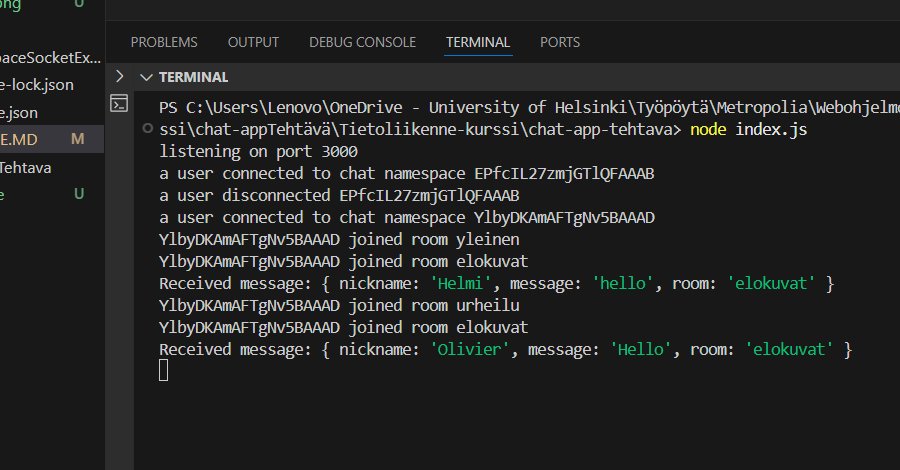
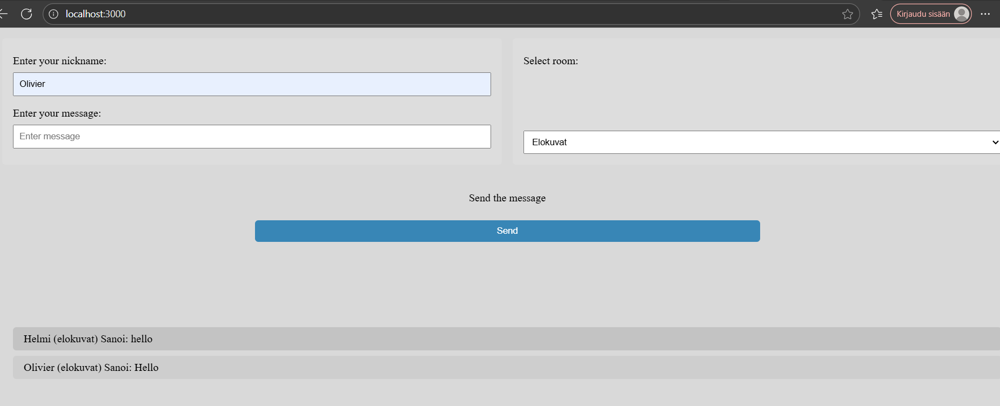
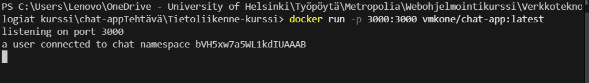
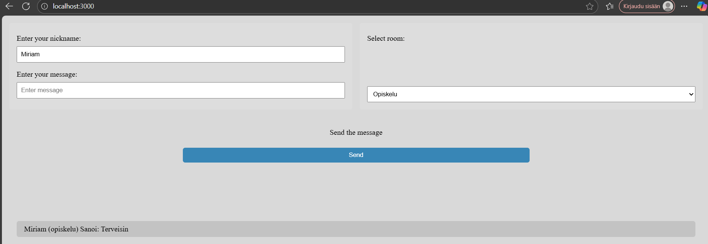
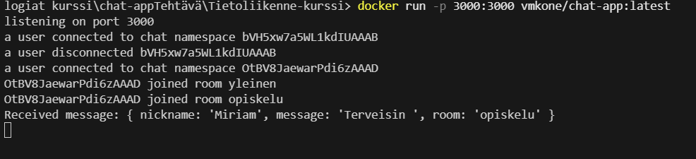

Tehty chat-apin ratkaisu:
    - Chat-sovellus tehtiin Node.js ja socket.io:lla
    - Chat-app docker-kontisointiin helppoa käyttöä varten.

Käytetyt komponentit:
    - public kansio, jossa on chat.js tiedosto, jossa on asiakaspuolen reaaliaikainen viestilogiikkoja.
    - index.js, jossa express-palvelin socket.io-integraatiolla ja mikä ajaa sovellus käskyllä "node index.js".
    -   Dockerfile & docker-compose.yml, Kontin käyttöönotto. Mikä mahdollista sovelluksen saattavuus ei vain sen määrittelylle portille vaan, myös jokaiselle jolla on Dockerin asennettuna ajamalla "docker run -p 3000:3000 vmkone/chat-app:latest" käskyä.

Sovelluksen käyttöönotto:
    - paikalliesti: npm install & node index.js käskyillä
    - Docker: docker-compose up --build ja "docker run -p 3000:3000 vmkone/chat-app:latest".

Tulokset:
Paikallisesti node index.js käskyllä:

Docker käskyllä docker run -p 3000:3000 vmkone/chat-app:latest:

